Livestream explanation
==================

This document describes the steps required to get the livestream page working.

To stream events within the hive on the website, it is necessary to have a host that streams the camera images to an url so that a link can be created between the web application and the camera. This url used to stream the camera images should then be included as a link within the video player on the web page of the web application.

This is done as follows;

For hosting/streaming this camera footage to a url, we recommend VLC Media Player. The following steps here show how to set this up.

Open vlc media player and go to Media -> stream...
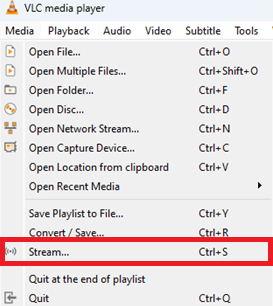

Go to the Capture Device tab, select the hive streaming camera and then click the Stream button.
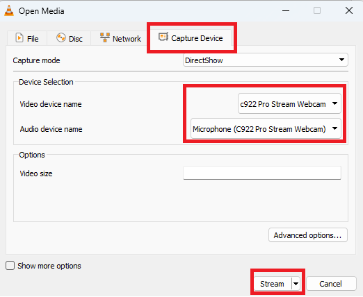

Then click the Next button.
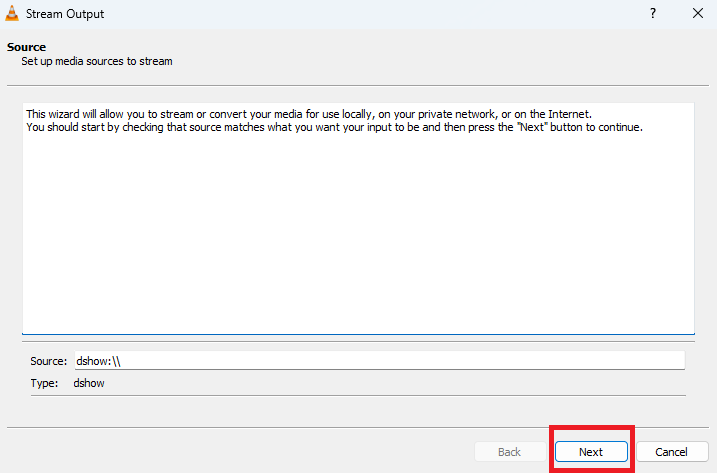

Select HTTP as the destination and then click the Add button.
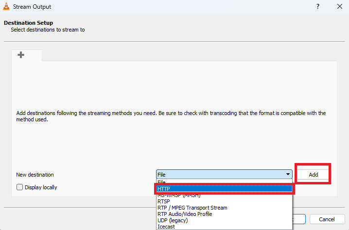

Next, enter the desired path and port where the camera images should be streamed to, and then click the Next button.
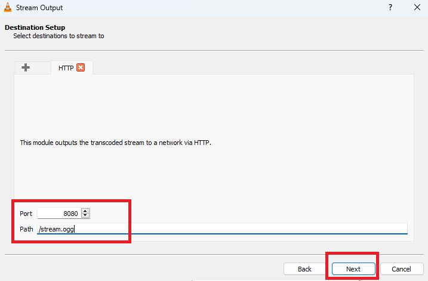

Next, select the desired format of the stream, in this case OGG, and adjust the settings of the stream if necessary by clicking on the tool icon. Then click next.
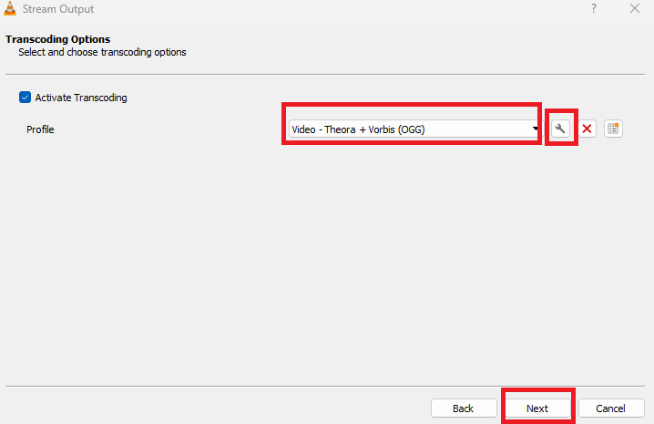

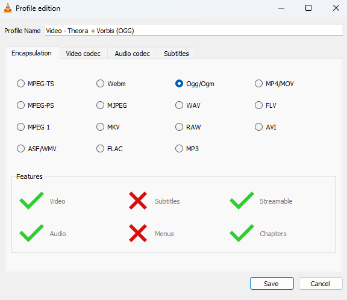

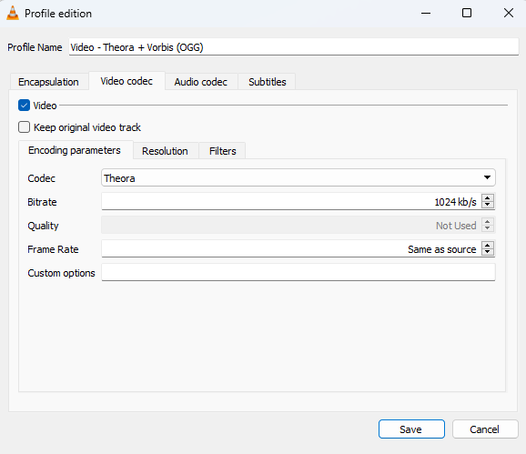

Next, select the Stream all elementary streams option and then click the Stream button.
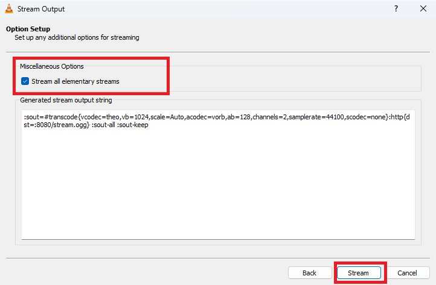

After these steps, the camera images are hosted/streamed at the following url: http://localhost:8080/stream.ogg

You then need this url to port forward this to a public url via the router. See how port forwarding works here: https://www.noip.com/support/knowledgebase/general-port-forwarding-guide/

This public url http:// {public ip address} :8080/stream.ogg should then be linked to the livestream page of a hive within the web application. The type of the livestream should be defined in this process.

On the add hive page, there is an option to add the url of the livestream to it. Enter the url of the live stream, select an organisation, enter a location and select a beekeeper. Then click the save button.

The overview of the hives then shows the created hive with the link of the livestream (watch live).
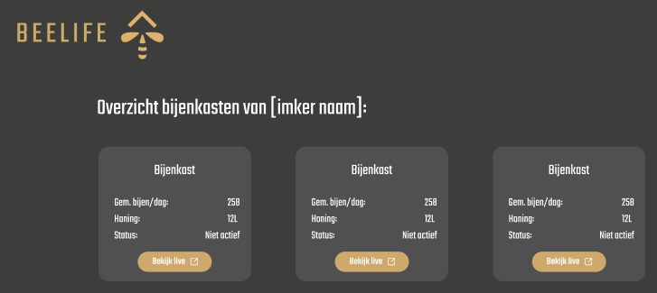

When this button is clicked, the livestream page is displayed, it may take about half a minute for the livestream to be visible as it works with a buffer.
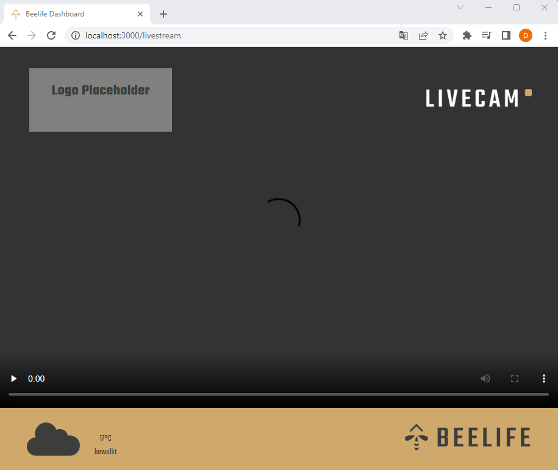