User manual Beelife web application
==================

This page describes the general operation of the Beelife web application
The login page is the first page you see when you enter the website. It asks for your username and password. Logging in gives you access within the web application system.

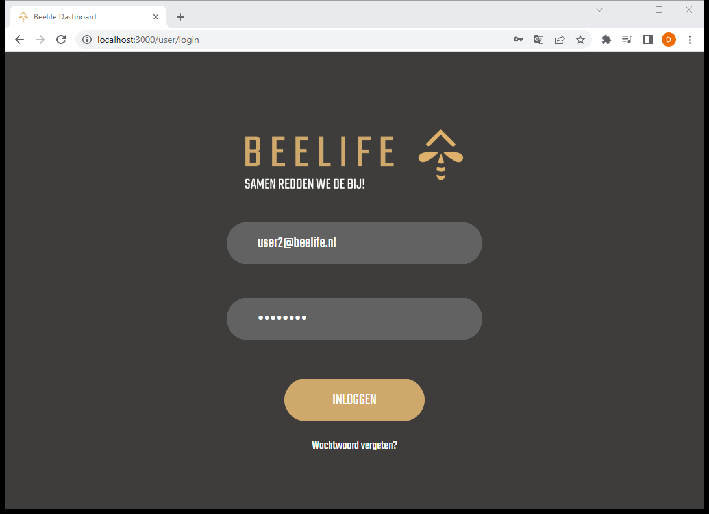

If you have forgotten the password, there is an option to reset it. This will ask for the user's e-mail address.

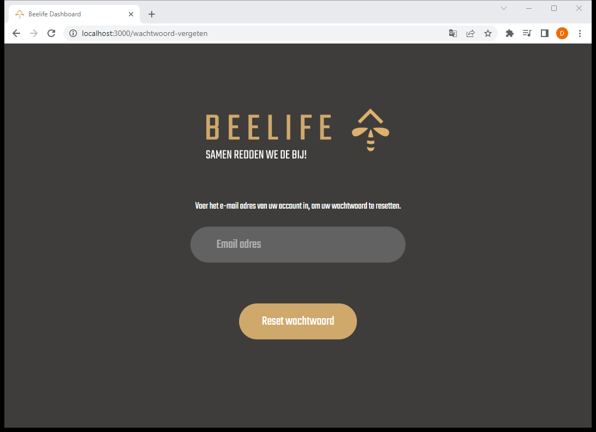

The dashboard page for organisations displays the statistics within the hive. It shows the bees flown in and out around the hive in the graph that can be seen in the picture. Furthermore, the dashboard page shows the statistics of flowers pollinated and km flown.

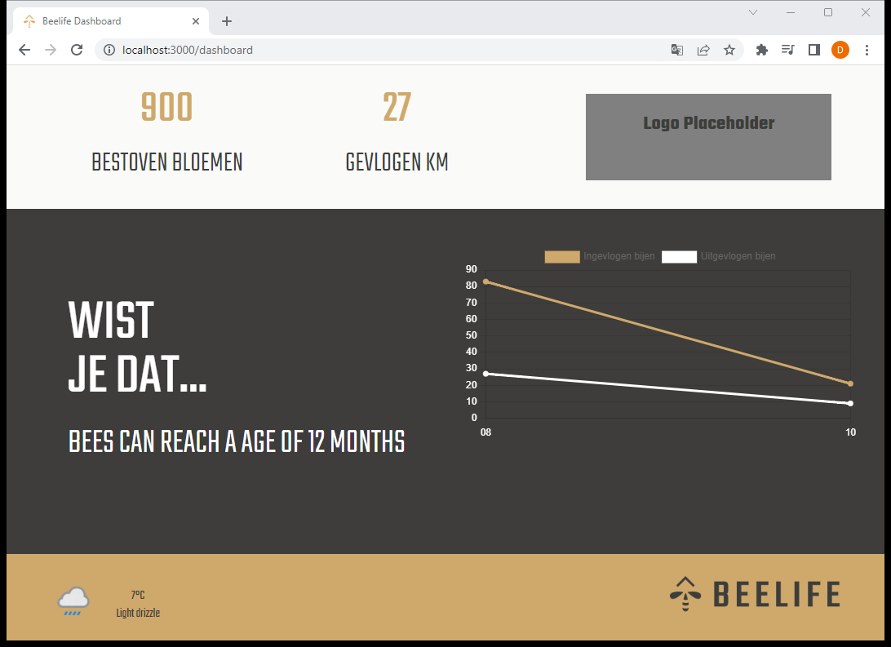

When the `Beelife` logo in the footer is clicked, a pop-up window pops up to contact, change password or log out.

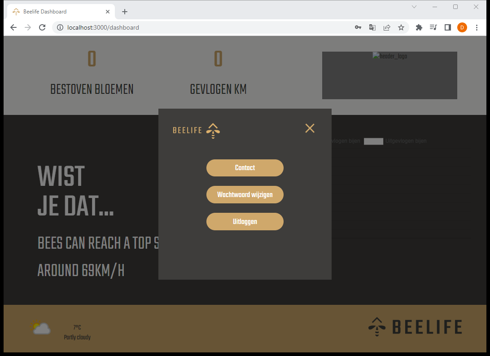

The dashboard page for an administrator looks different. On this page, an organisation/beekeeper's hives are displayed in the overview where there is an option to watch a live stream of the hive and see its statistics. A beekeeper will see the same page without the option to add a hive, beekeeper or organisation.

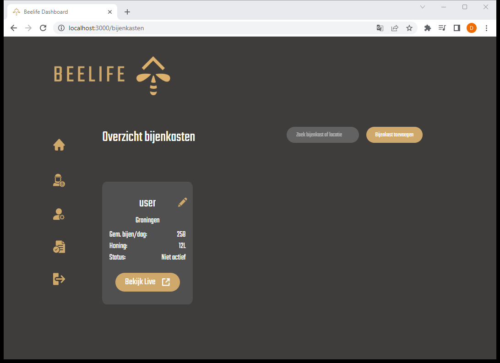

A beekeeper/administrator can view the livestream within the hive by clicking on the `View Live` link. The livestream is then loaded and displayed on the livestream page.

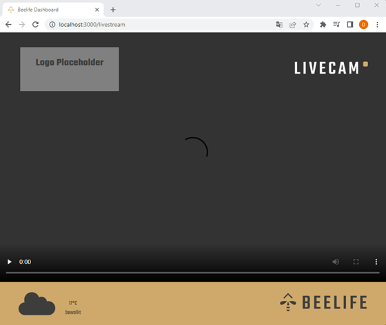

By clicking on the button `Add hive` on the overview page of the hives as an administrator, a hive can be added to the overview.

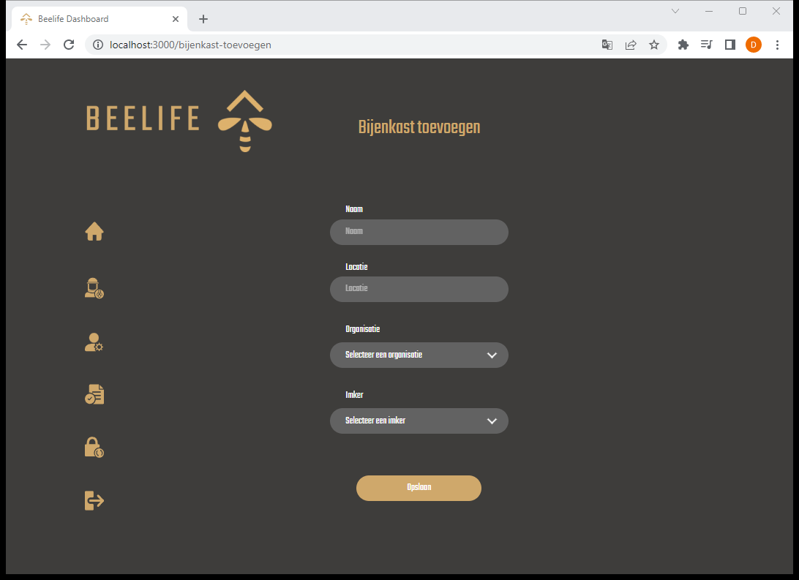

This page asks for the name of the hive, location, the organisation and beekeeper that the hive will be associated with. These organisations and beekeepers can be created on the beekeepers and organisation (manage) page found on the left in the navigation bar. Once the details have been entered, the hive can be added to the overview.
On the Manage beekeepers/organisations page, the administrator can see an overview of the beekeepers/organisations. On this page, you can view a beekeeper/organisation by clicking on the eye icon, edit it by clicking on the pencil icon or delete it. There is also an option to search for a beekeeper/organisation.

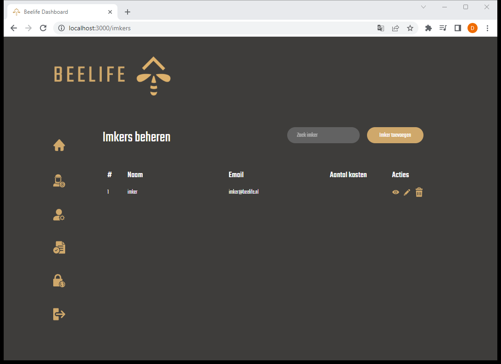

By clicking on the add beekeeper/organisation button, a beekeeper/organisation can be added to the overview.

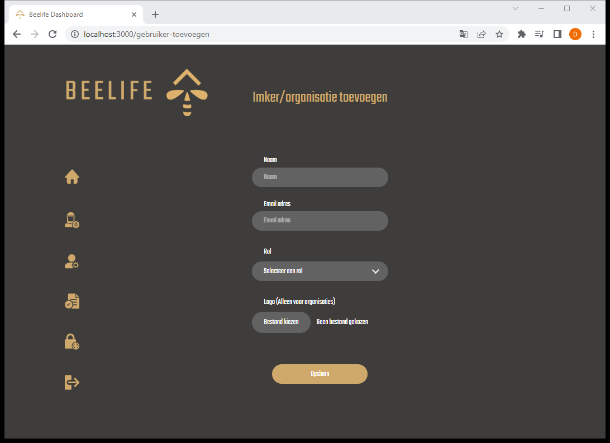

On the add beekeeper/organisation page, you will be asked for the name, e-mail address and role whether you want to add a beekeeper or organisation. When adding an organisation, it is possible to upload a logo so that it is displayed on the dashboard page. When the details have been entered, you can click save.
On the password setting page, which can be accessed by clicking on the lock icon on the left of the navigation bar, you can reset the password. Users are also referred to this page the first time they create an account. This requires entering the current password, new password and a confirmation of the new password.

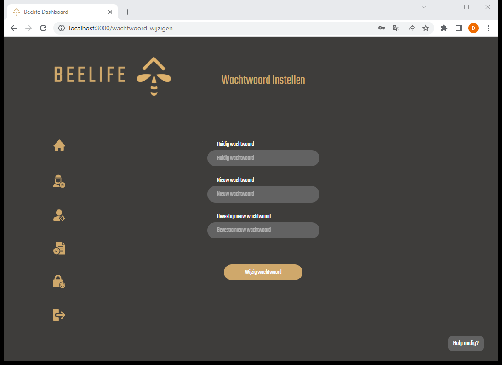

If you need help, there is an option to contact us by clicking the help button at the bottom right.
The contact page can be accessed when logged in as an organisation by clicking the Beelife icon in the dashboard footer and then clicking the contact button.

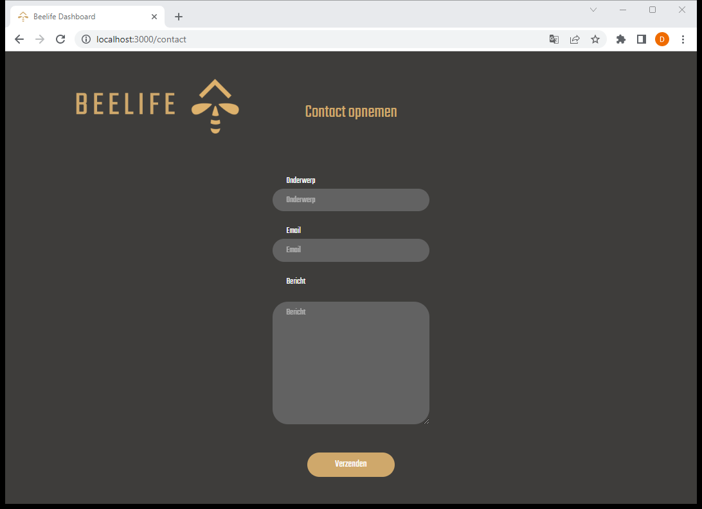

To contact, enter the subject, e-mail address and message, then click the send button.
